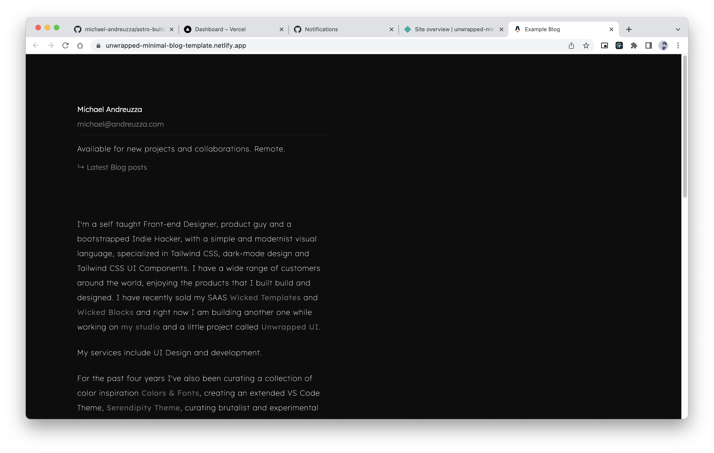

 
Unwrapped minimal blog template with Astro
# Repo:
- https://github.com/michael-andreuzza/astro-build-minimal-blog-starter
# Preview:
- https://unwrapped-minimal-blog-template.netlify.app/
# Unwrapped minimal Blog template.
Features:
- ✅ SEO-friendly setup with canonical URLs and OpenGraph data
- ✅ Full Markdown support
## 🚀 Project Structure
Inside of your Astro project, you'll see the following folders and files:
```
├── README.md
├── astro.config.mjs
├── package.json
├── public
│   ├── favicon.ico
│   ├── social.jpg
│   └── social.png
├── src
│   ├── components
│   │   ├── Author.astro
│   │   ├── BlogHead.astro
│   │   ├── BlogPost.astro
│   │   ├── BlogPostPreview.astro
│   │   ├── Heading.astro
│   │   └── Paragraph.astro
│   ├── layouts
│   │   └── BlogPost.astro
│   ├── pages
│   │   ├── index.astro
│  
└── tsconfig.json  
└── tailwind.config
```
Astro looks for `.astro` or `.md` files in the `src/pages/` directory. Each page is exposed as a route based on its file name.
There's nothing special about `src/components/`, but that's where we like to put any Astro/React/Vue/Svelte/Preact components.
Any static assets, like images, can be placed in the `public/` directory.
## 🧞 Commands
All commands are run from the root of the project, from a terminal:
| Command           | Action                                       |
|:----------------  |:-------------------------------------------- |
| `npm install`     | Installs dependencies                        |
| `npm run dev`     | Starts local dev server at `localhost:3000`  |
| `npm run build`   | Build your production site to `./dist/`      |
| `npm run preview` | Preview your build locally, before deploying |
## 👀 Want to learn more?
Feel free to check [Astro's documentation](https://docs.astro.build) or jump into their [Discord server](https://astro.build/chat).

If you have any question feel free to contact me on Twitter at twitter.com/Mike_Andreuzza